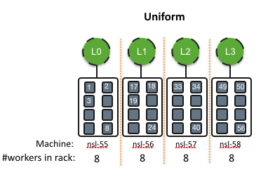
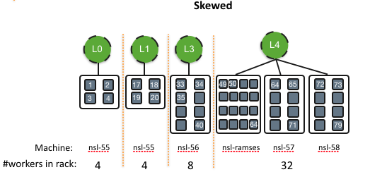

This repository contains the code for programs that run on end-hosts for Saqr in-network scheduling experiments.
The code is based on [Racksched repo](https://github.com/netx-repo/RackSched) with modifications based on our network protocols and queue model. 

The modified parts are commented with tag *SAQR* in the source code.

- *server_code* folder contains the code that runs on worker machines that serve the tasks.
- *client_code* folder contains the code that runs on clients, generates the requests, sends them to network and captures the replies from workers.

------
# Setting up worker machines
These steps need to be done only once for setting up the worker machines
## Downgrading Kernel Version to 4.4
Dune which is a required component for Shinjuku did not compile/run successfully on newer Kernels.
### Download and install old kernel
> General note:  after reboot the 10G interface might get precedence and system could boot using that. In that case we get locked out!
> To fix this, make sure that only the primary interface is up in interface defult setting: /etc/network/interfaces.
Based on these sources: [1](https://serverascode.com/2019/05/17/install-and-boot-older-kernel-ubuntu.html) and [2](https://unix.stackexchange.com/questions/198003/set-default-kernel-in-grub).

Install the old kernel:

```
sudo apt install linux-image-4.4.0-142-generic
```

Hold: Since Ubuntu regularly wants to upgrade you to a newer kernel, you can apt-mark the package so it doesn't get removed again
```
sudo apt-mark hold linux-image-4.4.0-142-generic
```
Based on this [source](https://askubuntu.com/questions/798975/no-network-no-usb-after-kernel-update-in-14-04), need to install headers and extras (had ethernet problem before this, not sure if necessary):

```
sudo apt-get install linux-headers-4.4.0-142-generic
sudo apt-get install linux-image-extra-4.4.0-142-generic
```
### Update GRUB

Comment out the current default grub in `/etc/default/grub` and replace it with the sub-menu's `$menuentry_id_option` from output of this command:
`grep submenu /boot/grub/grub.cfg`
followed by '>', followed by the selected kernel's `$menuentry_id_option`. (output of this command: 
`grep gnulinux /boot/grub/grub.cfg`).

Example GRUB_DEFAULT:
```
"gnulinux-advanced-b9283994-ad47-412a-8662-81957a75ab4d>gnulinux-4.4.0-142-generic-advanced-b9283994-ad47-412a-8662-81957a75ab4d"
```
Update grub to make the changes:
```
$ sudo update-grub
```

> **Reverting to latest version:**
To revert to latest kernel just need to uncomment the line 
#GRUB_DEFAULT=0 in /etc/default/grub again.

Then reboot the system.

### Disable KASLR

Dune does not support kernel address space layout randomization (KASLR). For newer kernels, you must specify the nokaslr parameter in the kernel command line. Check before inserting the module by executing  `cat /proc/cmdline`. If the command line does not include the nokaslr parameter, then you must add it. In order to add it in Ubuntu-based distributions, you must:

-   edit the file  `/etc/default/grub`,
-   append  `nokaslr`  in the  `GRUB_CMDLINE_LINUX_DEFAULT`  option,
-   execute  `sudo grub-mkconfig -o /boot/grub/grub.cfg`, and
-   reboot the system.


### Install the default NIC  drivers
Without this step, the default ethernet did not show up after reboot. 

Follow [these](https://askubuntu.com/questions/1067564/intel-ethernet-i219-lm-driver-in-ubuntu-16-04) instructions to install the driver manually.

It takes a couple of minuets for system to get DNS settings. Manually Add these lines to `/etc/resolv.conf` (with sudo access):
```
nameserver 142.58.233.11
nameserver 142.58.200.2
search cmpt.sfu.ca
```

> Side note: On cs-nsl-55 when keyboard is connected, the system won't boot until you press F1! That is because of the [Dell's Cover openned alert](https://www.dell.com/support/kbdoc/en-ca/000150875/how-to-reset-or-remove-an-alert-cover-was-previously-removed-message-that-appears-when-starting-a-dell-optiplex-computer)! (not resolved)

## Build
The setup.sh script installs the required library and components for running the worker code and RocksDB. 
```
cd ./server_code/shinjuku-rocksdb/
./setup.sh
```
In summary the script does the following: (1) Installs libraries (e.g libconfig-dev), (2) fetches Shinjuku dependency repositories (e.g., DPDK), (3) Applies our patch for Dune to make it run on the lab machines, (4) Builds the fetched projects and (5) inserts the kernel modules.
 
#### After Reboot
The "after_boot.sh" script should be run after each reboot.  It adds the kernel modules, allocates the needed 2MB hugepages for DPDK, and unbinds the 10G NIC from Kernel driver. 
> Note: might need to modify the NIC name for the machine in the script as instructed (e.g., 0000:01:00.0)


# Setting up Clients
These steps are only needed for the machine that runs DPDK client.
## Build
### Build dependencies
Setup the DPDK environments variables (or alternatively, add them permanently):
```
export RTE_SDK=/home/<username>/dpdk/dpdk-stable-16.11.1
export RTE_TARGET=x86_64-native-linuxapp-gcc
```
> Note: modify the line that uses NIC PCI address in ```setup.sh``` depending on the interface card that will be used for experiments.
```
./client_code/client/tools/tools.sh install_dpdk
./setup.sh
```

### Build the client code
```
cd ./client_code/client/
make
```

## Worker Configurations
In ```server_code/shinjuku_rocksdb``` the config files for each machine used in our testbed are provided. On each machine rename the corresponding config and name it as "shinjuku.conf".
For example, on machine cs-nsl-55:
```
cp shinjuku.conf.nsl-55 shinjuku.conf
```
### Allocated CPU Cores
The line "***cpu"*** in the shinjuku.conf refers to the ID of cores that will be allocated for Shinjuku. First two work as *"networker"* and *"dispatcher"* and the rest of them will be *"workers"* serving the tasks. 

### NIC Device
The line ***"devices"*** specifies the PCI device ID for the NIC that will be used for shinjuku. 
> We used one port of NICs, as 10Gbps is more than the capacity of a single machine (#tasks/s that a machine can handle can not saturate 10G). Also, note that I tried this setup on Ramses to use two different NICs but Shinjuku did not work properly with two NICs in configurations and had an issue (seems like concurrency bug) for sending reply packets.

### Worker IDs
In our experiments we use the following two setups for worker placement. Each setup requires configuring the Shinjuku using shinjuku.conf file. 
Depending on the intended setup, the line in shinjuku conf that mentions ***"port"*** should be modified with the assigned IDs to the worker cores. The lines are already in the configuration templates and just need to uncomment the line based on the intended setup.
These port IDs used for matching with ```hdr.dst_id``` in packets to queue the task in the corresponding queue for the worker and also makes sure that task will run on the  worker core selected by the switch scheduler.
> Note: dst_id as selected by switches is 0-based (in controller we use 0-n IDs) but in Shinjuku these ids start from 1, our modified code takes this into consideration and port IDs in the shinjuku.conf should be 1-based index.


#### Balanced/Uniform Setup
The figure below shows the uniform (i.e., balanced) placement setup. 
The python controller in switch codes puts one machine per rack (by logically dividn the register space). Note that the IDs assigned to worker cores are based on a hardcoded parameter in the switch which defines the boundaries for array indexes of each rack. E.g., in our case we used 16 as the boundary, so the IDs for racks start at 1-17-33-49 and etc.
> In real-world setup, this boundary should be set to max. expected leaves per cluster for spine switches and max. number of workers for each vcluster per rack.
 
 

#### Skewed Setup
The figure below shows the setup and assgined worker IDs  for the Skewed worker placement. The boundaries for arrays are similar to the previous setup. That's why the worker IDs for second rack starts at 17.




## Running Experiments
### Run the switch program
The P4 codes and instructions to run the switch program are provided in [this repo](https://github.com/parhamyassini/saqr-p4). 

### Run the Workers
1.  Make sure that shinjuku.conf is correct according to previous part of the instructions. 
2. Run Shinjku (and RocksDB) using ```./build_and_run.sh```. The script will make a fresh copy of the DB, builds shinjuku and runs it. 
3. Wait for the outputs log that mentions worker is ready ("do_work: Waiting for dispatcher work"). 


### Run the client(s)
Run the client using the following command:
``` 
sudo ./build/dpdk_client -l 0,1 -- <args>
```
The first arg after *-l* is an input for DPDK indicating that we use two cores (one for RX and one for TX loop). The rest of args (after ``--`` are inputs to dpdk_client.c) and will configure the behaviour of the client.

**args:** 
The first arg ```-l``` is input for DPDK and tells it to use two cores (0,1). One core will process sending loop and another core will handle the receive loop for reply packets.
The rest of args are handled by our code:

* ```-l```: (is) **L**atency client?; Type: bool. 

	 1: runs RX loop and records the response times. 
	 
	 0: Just sends the packets (used for multiple clients case)
	 
* ```-d```: **D**istribution; Type: string;

	"db_bimodal": Runs RocksDB requests with 90%GET-10%SCAN.
	
	"db_port_bimodal": Runs RocksDB requests with 50%GET-50%SCAN. 
* ```-q```: Req. rate (**Q**PS). Type: int;

	An integer speciying the rate per second. The requests will have an exponential inter-arrival time where mean inter-arrival is calculated based on this parameter.
	
* ```-r```: (is) **R**ocksDB; Type: bool;

	1: Means using rocksDB (*We only use this setup*)
	
	0: Means using synthetic workloads

* ```-n```: Experiment **N**ame; Type: String;

	String attached to the result file name to distinguish the different 	expeirments. E.g. "rs_h" or "saqr".

Example:
```
sudo ./build/dpdk_client -l 0,1 -- -l 1 -d db_bimodal -q 30000 -r 1 -n saqr
```

#### Running multiple clients
For rates up to 200KRPS, we use one machine (cs-nsl-62) and for higher rates we used two machines (cs-nsl-42 and cs-nsl-62).

> We ran simple experiments to make sure that the bottleneck is not at the request generator. In that experiment, we sent packets from client to switch and  the switch sent back every packet immediatly to the client. We measured the response time as we increased the request  rate. The results  showed that around ~240KRPS the client gets saturated and the delays start to increase and before this point the delays were consistant and low (few microseconds).  Therefore, we avoid generating higher rates than 200K using *one* machine. 

For clients, we use ID 110 for nsl-62 and ID 111 for nsl-42 (e.g., ```#define CLIENT_ID 100``` in dpdk_client.c) . 

Also, we used spine scheduler ID 100 in our experiment (```#define SPINE_SCHEDULER_ID 100``` in dpdk_client.c). This ID is assigned to every switch in the network (in spine P4 code we have the same ID).  

To generate the loads we used this setup:
- For load <= 200K: Use cs-nsl-62 only. 
- For 200K < load <= 300K: Generate 100K on nsl-42 and the rest on nsl-62.
 - For load > 300K: Generate 200K on nsl-42 and the rest on nsl-62.

To do so, run the client codes on the desired machines. 


### Collecting the latency results
For each experiment (each load point), we run the experiment for ~15sec and stop the client using ```ctrl + c```. When client code is terminated, it will save the latency result outputs and the prints the total task pkts sent and reply pkts received.

> Note: The client program generates requests and sends them (TX loop), and captures the  the reply/result for tasks (RX loop); it compares the current time with the request generation time to calculate the total response time. We also attach the qlen of worker that sent the reply in the packet and store that result in RX loop as well.

The result for each experiment will be saved in the following format in the ```results/``` directory: ```"output"_"experiment-name"_"task-distribution-name"_"rate"```. 
For example, running saqr experiment at rate for 90%GET-10%SCAN (db_bimodal) and at 30000 RPS rate gives: ```output_saqr_db_port_bimodal_30000```.

The main output file contains response time for every task in nanoseconds. In addition, client generates the following outputs:
* ```<output>.long```: response ns for long tasks only (SCAN)
* ```<output>.short```: response ns for short tasks only (GET)
* ```<output>.ratios```: ratio of response time / service time
* ```<output>.queue_lengths```: queue len of worker that executed the tasks.

### Collecting the overhead results
The results for the msg rate and processing overheads could be collected directly from the switch controller python script which reads the register values (internal state of switch). 

The details can be found in [this repo](https://github.com/parhamyassini/saqr-p4). 

> Note that we need to record the number of tasks and task rate for each experiment form client outputs in addition to the switch controller outputs. We use the total number of tasks (output of client) and the task rate (e.g., 30KRPS) to calculate the exact experiment duration. Then, we will use the total number of msgs to calculate the *rate* (#msgs/duration(s)).

### Analyze/plot the results
> The python script ```parselats.py``` is useful for quickly getting the 99th percentile mean and median from the response times. It gets one argument which is the file to be anlayzed. Example:
```python parselats.py ./results/output_saqr_db_port_bimodal_90000```

The results for response times (ones used in the paper) are stored on the 2TB SSD drive under ```./saqr-result/testbed``` folder. 
The response time metrics are plotted based on the output files generated by client script and the overhead metrics (e.g #resubmissions, #msgs, and etc.) are summerized in the python code as arrays. Also, the  load steps (x-axis ticks) depends on workload and placement these are hardcoded in the script based on our experiments.

The python script ```plot_results.py``` is the one used for plotting the testbed results in the paper. 

#### Input Arguments
* ``-d`` **W**orking directory: The directory to read the response time files. The output plots will be also saved in ```./<working-dir>/plots``` folder.
* ```-t``` **T**ask distribution type: can be "db_bimodal"(90%GET-10%SCAN) or "db_port_bimodal" (50%-GET-50%SCAN).
* ``-s`` Placement **S**etup: indicates that the result to be plotted is for which worker placement setup: use "s" for skewed and "b" for balanced (i.e., uniform).
*  ```--overheads```: Optional argument which indicates that overhead metrics should be plotted or the response time metircs (for response time do not pass this option).

 > The current plotting script is just plotting the 99th percentile response time. However the written function is configurable for different metrics (e.g queue len) and different stats (e.g average instead of 99%)  see the commented function calls for details.
 > 
## Known Issues
### Dune hardware compatibility issue
Sumamry of the issue and root cause (as far as we know) are below. TD;LR To run our nsl-5* machines Intel(R) Xeon(R) E-2186G CPU, we need to disable Dune's APIC Interrupt calls. Also, we disable the preemption mechanism in Shinjuku (it's by design;  as we did not intend to evaluate the server scheduler). In our experiments we do not rely on preemption feature of Shinjuku as worker cores have dedicated task queues. 
When running Shinjuku it freezes when calling the init function of Dune.  
It freezes just after  [this line](https://github.com/kkaffes/dune/blob/78c6679a993b9e014d0f7deb030dc5bbd0abe0b8/libdune/entry.c#L481). CPU gets stock after creating vCPU.

>For Dune, [this repo](https://github.com/ix-project/dune) works fine on our machine but the one Shinjuku uses is from this repo [this repo](https://github.com/kkaffes/dune). The problem is that the second repo adds some new APIs and functionalities to Dune that are necessary for Shinjuku so it is not possible to simply use the first Dune. 

>The issue was related to the usage of Advanced Programmable Interrupt Controllers (APIC) in Dune. It seems like there are multiple operations on the "hardware-specific register" and the address of these registers and values were hardcoded in Dune codes. I think there might be changes in these hardware-specific registers in the next-gen Intel CPUs and that's why it worked on Ramses but didn't work on nsl-55 (the CPUs are from different year/generations).
